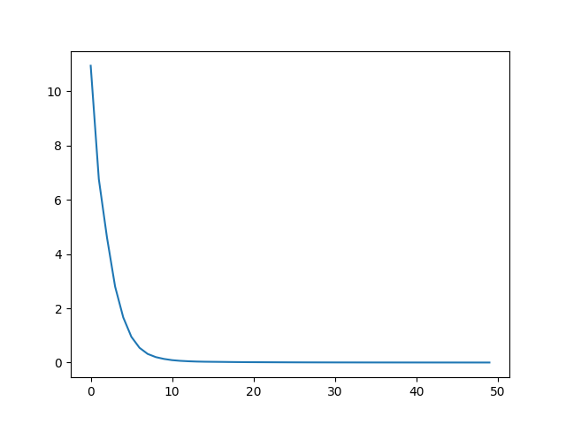
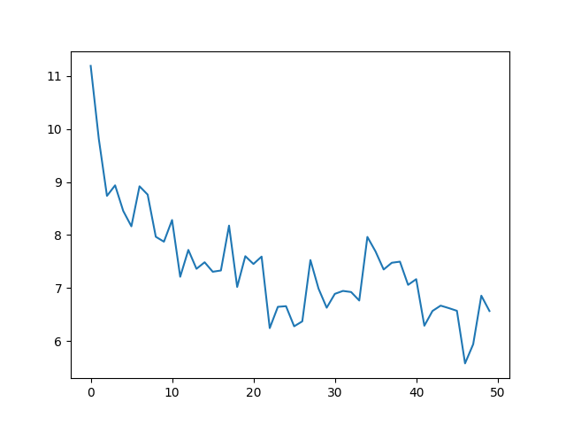

This is the notes summary of reproducing GPT2 from scratch. I've tried to understand and capture the small details from the source video.

***Materials:***

1. Source: [Anderj Karpathy's Let's reproduce GPT-2(124M)](https://www.youtube.com/watch?v=l8pRSuU81PU&t=29s)
2. GPT2 paper for details and [GPT3 paper](https://arxiv.org/pdf/2005.14165) for hyperparameters(this is not that clear in GPT2 paper and architecture doesn't vary much from GPT2).
3. [Source Repository for the article](https://github.com/JpChii/gpt2-reproduced)
4. https://medium.com/@girishajmera/improve-your-pytorch-model-training-time-with-torch-compile-99db541389ac - torch.compile
5. https://arxiv.org/pdf/2205.14135 - Flash Attention

## Approach
  
First we'll explore our final objective GPT2 model ans sample tokens from it.

GPT2 implementation uses TensorFlow, we need a PyTorch implementation since it's the most used framework with other libraries. https://github.com/openai/gpt-2/blob/master/src/model.py

We'll use HuggingFace transformers implementation of GPT2, because it's written in pytorch.

## Creating a model from Scratch

1. Load the hugging face model and explore the layer shapes, dimensions etc.
2. Different variants of GPT2 series in huggingface "gpt2", "gpt2-medium", "gpt2-large", "gpt2-xl".gpt2 is the 124M model.d

### Model layers - skeleton

1. Define Positional Embedding layer
2. Define Token Embedding layer
3. Define Blocks. Each block is a combination of CasualAttentionLayer, MLP
4. Final layer normalization layer
5. Final Linear layer to calculate logits



*Naming convention for these layers should match the huggingface model layer name's.*

### CasualAttentionLayer

* Attention block - where all relationships between tokens are learned
* Implement the same multi headed attention logic as nangpt but in much efficient manner
* Implements accepting a batch of inputs
* Calculates query-key-vectors
* Calculates attention scores
* Calculate scaled dot product attention to calculate attention weights - the tril value etc in nanogpt implementation
* Concatenate all attention weights
* reduce in map-reduce

Gist below, goes through layers and efficient implementation of attention mechanism via forward(). 



### MLP

* Computation block after attention block
* In two linear layers between activation we increase the computation by 4*embedding dimension. The 4 comes from sd_hf transformer.h.11.mlp.c_fc.weight torch.Size([768, 3072])
* 3072 /4 = 768
* We use GELU, due to it's smoothness(Send a small until a certain limit in x-axis for negative values and then sends zero)
* This smoothening reduces vanishing gradients
* To replicate GPT2 paper approximate implementation of GELU from pytorch is used. This is no longer needed
* map in map-reduce




### Block

Block commbines AttentionLayer and MLP layer with pre-normalization, residual connections to inputs.

* Implements Normalization -> Casual Attention + Residual Connection
* Implements Normalization -> MLP + Residual connection
* A clean gradient goes through residual connection and attention normalization block alters the gradient accordingly



### Load pretrained weights

We'll be loading weights from huggingface model to our scratch model.

* Defines neural network parameters
* Load Local implementation model and hf model
* Load both state dicts
	* Remove .attn.bias, .attn.masked_bias
* transpose bias keys, weights are in Conv1D in original paper. With transpose we'll load weights to Linear Layer.



### Forward pass

* Accepts, idx(input tokens in batches), targets(optional) labels
* Create positional embeddings, token embeddings, pass through block list, get logits from lm_head
	* Add positional information with word information
	* the same position embeddings applies for each input in batch, broadcasting happens internally
* Calculate loss if targets is not None
	* cross entropy((B*T, vocab_size), targets)
	* logits.view preservers final dimension and merges batch and tokens into a single dimension
* Return logits and loss



## Dataset creation

[Shakespearean dataset](https://raw.githubusercontent.com/karpathy/char-rnn/master/data/tinyshakespeare/input.txt) - We'll use this data to perform a scaled down training.

When training a language model for next token prediction, the dataset needs to be prepared in a specific format. This involves encoding the text and creating input-output pairs where the input is a sequence of tokens and the output is the next token in the sequence.

1. **Encoding the Text:** The text is first encoded using tiktoken. This converts the text into a sequence of numerical tokens.
2. **Creating Batches:** The encoded sequence is then divided into batches of a fixed size. Each batch contains multiple sequences of tokens.
3. **Creating Input-Output Pairs:** For each sequence in the batch, the final token is removed to form the input, and the remaining sequence becomes the output. This is because the model is trying to predict the next token based on the preceding tokens.

Code walkthrough below explains how to achieve the above steps. We can also put the below into a neat little function for reusability.

```Python
# Let's create batch size of 8 with 32 tokens in a single sequence
# B, T -> (8, 32) -> 8*32(256) tokens needed

B = 8
T = 32

# Get B*T + 1(target token) from dataset. Additional final token is for dataset creation.
buf = torch.tensor(tokens[:B*T + 1])
# tokens[-1].view(B, T) -> input tokens. Leave final token for target
x = buf[:-1].view(8, 32)
# tokens[1:].view(B, T) -> output tokens. Leave first token as it can't be predicted as target
y = buf[1:].view(8, 32)

# view here takes 256 tokens cuts them by T and arranges them vertically in a size of B.
# order of tokens are preserved with this view
```

## Training

### Initial Loss

With this we can take our scratch model without weights from huggingFace for a run. The CrossEntropyLoss should be around -ln(1/50257) = 10.824. The math is a fancy way of saying the model should have the same probability for all tokens in the vocab size(50257) after intialization. This is the negative log likelihood explored in nanoGPT repo as well.

```Python
# Random intialized model
model = GPT2(GPTConfig)
model.to(device)
x, y = create_data(B=4, T=32)
logits, loss = model(x, y)

# output
tensor(10.8322, grad_fn=<NllLossBackward0>)
```

### Single Batch Overfit

Next step: We'll overfit a single batch of data. This executes a full training loop.

```Python
# Initialize model
losses = []
model = GPT2(GPTConfig)

# Initialize optimizer
optim = torch.optim.AdamW(
	params=model.parameters(), # Parameters for backprop
	lr=3e-4, # This is good initial learning rate
)

x, y = create_data(B=4, T=32)
# Initialize training loop
for i in range(50):
	# Optimizer zero grad
	optim.zero_grad(set_to_none=True)
	# Forward pass
	logits, loss = model(x, y)
	# Backward pass
	loss.backward()
	# Update parameters
	optim.step()
	print(f"Step {i}: {loss.item():.4f}")
	losses.append(loss.item())

print(losses)
```

*Loss visualization*


With this loss progression, we can see the loss is crunched really fast. The transformer has memorized/overfitted on this single batch.

### Full Batch training(but really for 50 batch)

Use the below dataloader for creating batches of data for training loop. This is an updated version of create_data() in data.py


Run the training loop.
```Python
# create dataloader
data_loader = DataLoaderLite(input_file="input.txt", B=4, T=32)

# Initialize model
losses = []
model = GPT2(GPTConfig)

# Initialize optimizer
optim = torch.optim.AdamW(
	params=model.parameters(), # Parameters for backprop
	lr=3e-4, # This is good initial learning rate
)

# Initialize training loop
for i in range(50):
	x, y = data_loader.next_batch()
	x, y = x.to(device), y.to(device)
	# Optimizer zero grad
	optim.zero_grad(set_to_none=True)
	# Forward pass
	logits, loss = model(x, y)
	# Backward pass
	loss.backward()
	# Update parameters
	optim.step()
	print(f"Step {i}: {loss.item():.4f}")
	losses.append(loss.item())
print(losses)
```

*loss visualization*


Inferences from output:
1. Number of tokens: 338025 # Compression ratio of 3:1 matches
2. Total number of batches per epoch: 2640

* Here, we can see the loss reduction is not as fast as single batch overfit but still the loss is decreasing...
* The plot seems noisy but the loss curve looks good.
* Here the gains are mainly from crunching the logits for unicode characters in the vocab to negative infinity. PS: no unicode characters in the dataset.

### Parameter sharing Token Embeddings and Final Linear Layer(Model Skeleton section update)

Let's explore the parameter exploration in attention is all you need paper. [Section 3.5 Embeddings and Softamx paper covers this](https://arxiv.org/pdf/1706.03762), output embedding and final lineary layer shares the same shape. Let's explore this in huggingface model.

If you explore token embeddings and lm_head layer weights shape, weight values and pointers they'll be the same. [Refer `Model update - Parameter sharing` section](https://github.com/JpChii/gpt2-reproduced/blob/main/playground.ipynb#).


Paper Excerpt:

Comparison of each individual weight is also the same. The reasoning behind this is from [paper 30](https://arxiv.org/pdf/1608.05859) referred in attention is all you need.

*We call U the input embedding, and V the output embedding. In both matrices, we expect rows that correspond to similar words to be sim- ilar: for the input embedding, we would like the network to react similarly to synonyms, while in the output embedding, we would like the scores of words that are interchangeable to be similar (Mnih and Teh, 2012).*

Thinking intuitively as well the above statement makes sense.
* Similar word embeddings are closer in embedding dimension plane.
* Similar words have similar scores in final layer before softmax.

***Major improvement is reduction of parameters, with(50,527, 768 - shape of token embedding and lm_head layers) 50527 * 768 = 39M Parameters roughly 40M. This is 1/4th of a 124M parameter GPT model. We've saved lot's of parameters as well.***

We'll use the pointer method to share weights between two layers:

`embedding_layer = lm_head_layer`
```Python
# weight sharing
self.transformer.wte.weight = self.lm_head.weight
```

### Model Initilization

Let's intialize the model more inline with GPT2. Initialization is more explicit in openai code for gtp2.py than paper.

In [code](https://github.com/openai/gpt-2/blob/master/src/model.py):
* model() function initialized wpe and wte to random normal distributions with std 0.01 and 0.02 respectivley.
* conv1d()(linear layer in our case) has std of 0.02.
* This 0.02 stands inline with xavier intialization which is 1/sqrt(number of incoming features). verification is in same section of the notebook.
* The number of incoming features for wpe, wte and linear layers are emedding dimension of different gpt variants.
* The different embedding dimensions are [768, 1024, 1280, 1600]

```Python
def _init_weights(self):
	# Loop through moduels of self.transformer and if they are nn.Linear or nn.Embedding set std to 0.02
	for module in self.modules():
	# This is xavier init median of vocab_size of different variants of GPT2. Refer notebook for more details
		std = 0.02
		if isinstance(module, nn.Linear):
			# initialize module.weight(tensor in place) to normal distribution with mean 0 and std 0.02.
			# normal_ underscore at the end performs inplace intialization to the tensor
			torch.nn.init.normal_(module.weight, mean=0.0, std=std)
			if module.bias is not None:
				torch.nn.init.zeros_(module.bias)

		if isinstance(module, nn.Embedding):
			torch.nn.init.normal_(module.weight, mean=0.0, std=std)
```

One more initlization left for residual connection. Residual connection in `Block`. In forward pass, the standard deviation of activations increases. To control this below's the excerpt from GPT2 paper:

***A modified initialization which accounts for the accumulation on the residual path with model depth is used. We scale the weights of residual layers at intialization by a factor of 1/ sqrt(N) where N is the number of residual layers.***

```Python
# Small example to explain this
import torch
x = torch.zeros(768)
for i in range(50):
	x += torch.randn(768)
print(x.std())

# tensor(7.2193)


x = torch.zeros(768)
n = 50 # number of layers
for i in range(50):
	x += n**-0.5 * torch.randn(768)
print(x.std())

# tensor(0.9861)
```

This is implemented in GPT skeleton using a flag for c_proj layer(final layer of MLP and Attention block). If flag is present for the layers, normalization is applied to the standard deviation. Here it's 2 * (n_layer ** -0.5) of std(0.02).

The complete GPT2 model code.



This brings up the conclusion of Part 1 of this three part article.

Next part, we'll cover the speeding up of training.