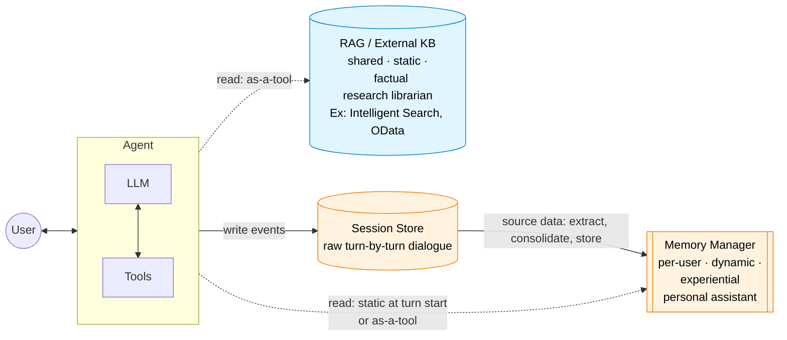
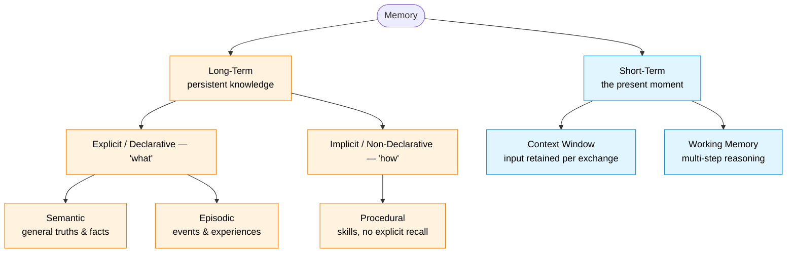
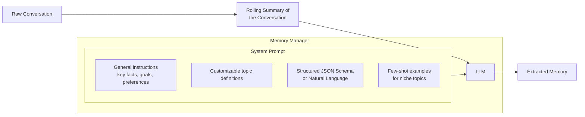
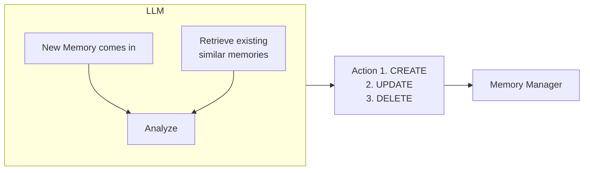
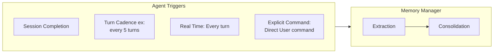
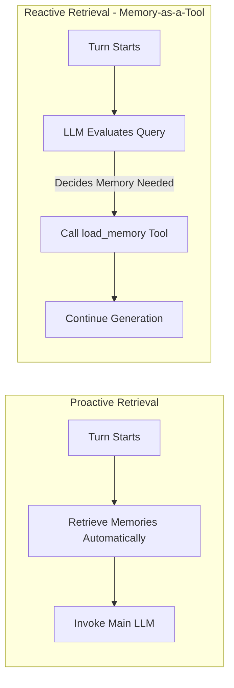
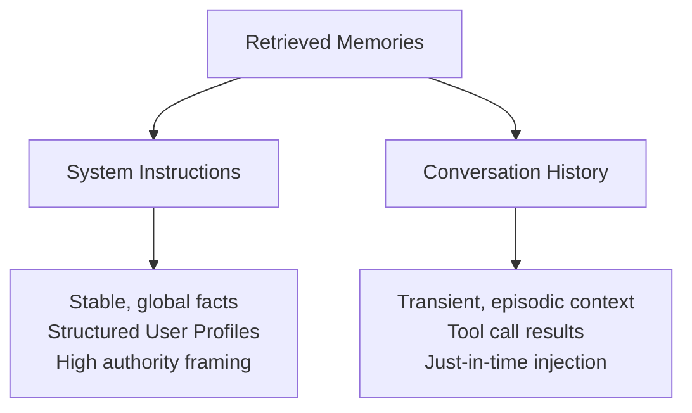

# Agentic Memory

## What is memory & why it matters

 Session is another name for working memory. Hereafter Working memory and session will be used iterchangeably.

Sessions and Memories share a symbiotic relationship, Sessions are the data source for memory and memory can help with managing the session(context window).

> In this section, memory means extracted information from the conversation and not the raw conversation.

Memory is defined by two things: it is *extracted* (condensed, meaningful information - not raw turns) and it is *persisted* across sessions. Persistence is what separates long-term memory from working memory: working memory is ephemeral and dies with the session, memory survives across sessions to provide continuity and personalization.

A seperate, specialized *memory manager* provides the foundation for creating, storing and utilizing memories.

Storing and retrieving memory transforms a basic chatbot into an intelligent agent by unlocking several capabilities:

    1. Personalization: User prefernces, facts.
    2. Context Window Management: As context window grows: replace it with summary, key facts etc.
    3. Agent Self-Improvement and Adaptation: Agent learns from previous runs by creating procedural memories about it's own performance - recording which reasoning, tool calls, reasoning paths led to successfull outcomes. Creating a playbook of effective solutions.

Creating, storing, utilizing memory in a agentic system is a collabrative process. Below is the stack:

    1. User: Raw data source for creating memories.
    2. Agent (Developer Logic): Configures what(retrieve memories) and when(at which part of execution) to remember, orchestrate calls to memory manager. Simple approach: Always generate and store memeories, always retrieve memories. More mature approach: Memory as a tool.
    3. Agent Framework: Enables Agent to interact with the memory store via it's tools and structure. Doesn't manage Long-Term Memory.
    4. Session Store(Redis): Stores the raw turn by turn conversation. Then it'll be ingested into memory manager.
    5. Memory manager (Mem0, Zep): Handles storage, retrieval and compaction of memories. This includes the following and not limited to:

        1. Extraction from sessions.
        2. Consolidation of memories - deduplication.
        3. Storage of memories to persistent databases
        4. Retrieval relevant memories to add to the context window.

> Memory manager is a decoupled service from the agentic system. Allowing the developers to focus on the agentic system development and leveraging the memory manager to enhance the system.

Memory manager is a lot similar with a RAG system(Semantic Memory). Below is how RAG differes from Memory Manager:

    1. RAG is powered by a shared knowledge of facts, documentations etc. An agentic system relies on RAG for additional context for facts documentations, domain knowledge.
    2. Memory manager: It's a private dynamic notebook on users personal preference, facts, past conversations, personal goals etc.
    3. RAG is a reserach librarian vs Memory mananger is a personal assistant. RAG provides facts on the knowledge, whereas Memory manager can provide experiences from previous conversations, working procedures etc
    4. Memory manager is an *active* system: the management logic - extraction, consolidation, curation - is intrinsic to the component, it owns the memory lifecycle. RAG is a *passive* vector DB: just a storage + similarity-search primitive, the "what to keep / dedup / merge" logic lives in a seperate ingestion pipeline built around it. In short: a memory manager *is* the curation; a vector DB is a dumb store that something else curates for.
    5. Memory manager is private, dynamic. RAG Knowledge base is shared, static.

# Types of Memory

> [!abstract] How to read this section — two altitudes
> What follows sits at **two different altitudes**, and conflating them is the main way this document gets misread:
> 1. **The intuition** — a *typology* of what kinds of memory exist (CoALA + HuggingFace). Answers *"what kinds are there?"*
> 2. **The design space** — the *engineering decisions* for building a memory manager (Google paper). Answers *"what knobs do I turn?"*
>
> The typology is **one axis** of the design space, **not a peer to it**. Read top-to-bottom: intuition first, then the space that subsumes it.

## The intuition — what kinds of memory exist

> CoALA and HuggingFace describe **nearly the same taxonomy**. CoALA names the four types; HuggingFace keeps the same leaves but adds a cleaner persistence root (long-term vs short-term) on top.

### CoALA framing (notebook)

> Source: ALucek's `agentic_memory.ipynb`, grounded in the CoALA paper. Split: working / episodic / semantic / procedural.

#### 1. Working Memory

1. Working memory is a single ongoing session between a user and agent or single worlflow execution in our case a flow execution in crewai
2. This includes and not limited to:

    a. Messages - user/assistant

    b. Goals

    c. Tasks

    d. Files/uploads

    e. Added context from tools

All of this cease to exits once the session ends.

Processing and Latency:

1. All the messages plus the new message from the user always gets `processed` by the model(LLM API).
2. `processed`:
    - List of messages User/Assistant, appended with latest user message is posted to the API.
    - Previous messages K/V tensor will be loaded from KV-Cache memory.
    - To decode and emit a single token from the latest message, the LLM still attends to all the previous messages(all tokens).
    - Latency compounds per output token within one generation and across turns, since previous messages stack onto the prefix.

> [!TODO] Learn: techniques to keep context window optimal within working memory (trim / summarize / filter / etc.)

> Working memory can also be termed as session.

#### 2. Episodic Memory

1. Episodic memory is a historical collection of working memory | episodes | sessions.
2. Episodic memory can be stored in two ways, full conversation[messages] as is or processed takeaways from the conversation. We can also store both, persist conversation history and then process it for takeaways. Takeaways here can be anything, ex: what worked, what not worked.
3. Post processing of conversations is essentially learnings from the episode. Reflection pattern is one of the ways to implement this.
4. Once our Episodes are stored, processed. We can retrieve successful instructions and include them as few shot examples to guide the llm. This has lots of caveats which will be covered later. -- This crossovers or cross align with procedural memory.
5. With episodic memory, a knowledge base is created. This knowledge base holds proven interaction patterns and their associated learnings.
6. with episodic memory, we have a continuously learning system at agent layer not with just individual interactions but from multiple conversations(episodes).
7. The takeaways can also be used to improve the prompts as well.

#### 3. Semantic Memory

1. Semantic memory is knowledge that the LLM's are not trained on, Knowledge that is not available in the internet. Few examples are, product documentation, technical specification, technical documentations, system logs etc.
2. Semantic memory is implemented by a RAG system. This RAG system will be leveraged by the agentic system and it's agents to retrieve relevant context according to the agent logic(defined by developers).
3. Semantic Memory differs from Episodic memory on where the memory comes from: Semantic memory comes from knowledge vs Episodic memory comes from user conversations.
4. Learning in semantic memory includes and not limited to the following:
    - update indexed documents, chunks as the original knowledge sources evolves.
    - Broaden the knowledge Base or Create multiple knowledge sources.updat
5. This additional context allows the agent to operate with groundedness to facts.

#### 4. Procedural Memory

1. Procedural memory sits opposite to semantic + epsiodic memory. LLM uses procedural memory to achieve an task/objective.
2. They're in two places: LLM weights and system prompt plus instructions[prompts].
3. We can pull up procedures that worked in previous interactions and plug them into prompts. This'll be also leveraging the knowledge base from episodic memory.

### HuggingFace framing (LTM / STM hierarchy)

> Source: Kseniase, [*"Memory"*](https://huggingface.co/blog/Kseniase/memory) on HuggingFace.

Same leaf types as CoALA, but it promotes the **persistence split (Long-Term vs Short-Term) to the root** and inserts a **declarative / non-declarative** layer in between:

How it lines up with CoALA:

- **Short-Term (context window + working memory) = CoALA's "working memory" = the session.** HuggingFace just promotes that persistence boundary to the top of the tree.
- **Long-Term → Explicit → {Semantic, Episodic}** and **Long-Term → Implicit → {Procedural}** are exactly CoALA's three *persisted* types, with a declarative / non-declarative parent layer added on top.

## The design space — building a manager (Google paper)

> Source: "Context Engineering: Sessions, Memory" by Milam & Gulli (Nov 2025).

> [!important] From intuition to the design space
> The intuition above is **not a peer** to what follows — it's **one axis of it**. Google keeps the *what-kind* typology as a single axis (*Types of Information*, below) and adds ~6 more orthogonal engineering axes. So: **subsume the typology as one axis, then add many axes.** Where the intuition types land:
>
> | Intuition type (CoALA / HF) | Where it lands in Google |
> |---|---|
> | Semantic | Types of Information → Declarative → Semantic |
> | Episodic | Types of Information → Declarative → Episodic |
> | Procedural | Types of Information → Procedural |
> | Working memory (CoALA) / Short-Term (HF) | *not a memory type* — it's the session; see **Memory scope** (session-level) |
>
> ⚠️ **Terminology collision on "explicit / implicit".** HuggingFace uses these for *declarative vs non-declarative* (a **knowledge-type** split — i.e. this very *Types of Information* axis). Google uses them on its **Creation mechanisms** axis for *user-commanded vs agent-inferred* (a **how-created** split). Same words, different axes: HF's explicit/implicit ≡ Google's declarative/procedural, **not** Google's explicit/implicit.

### Foundations — What is a Memory?

1. Memory is the atomic unit of context returned by memory manager system.
2. Memory is classifed based on what is stored and how it's captured.
3. Memory is descriptive and not predictive.
4. Memory has two components: Content and Metadata:
    - Content: extracted information from raw conversation.
    - Content can be structured(json or dict) or unstrucutred(natural langauge).
    - Meatadata: Is typically stored as a simple string.
    - Metadata: Can be a unique id or user pointer or labels to query the memory manager to retrieve memories.

### Types of Information — What kind of knowledge?

1. Inline with earlier statement: Memory can be classified based on the fundamental type of knowledge they represent. How an agent uses memories seperates memory into two categories declarative memory and procedural memory.
2. If a memory answers an agent's question of `what?` then it's declartive memory. Declarative memory something the agen can state or declare: facts, figures, events. This includes semantic memory(RAG) and episodic memory.
3. If a memory answers an agent's question of `how?` then it's a procedural memory. It guides the agent on how to perform a task.

### Organization patterns — How are memories structured?

Once a memory is created, the next question is how to organize it. Three patterns:

1. **Collections**: store memories as they come in, like multiple tiles or sticky notes. A larger, unstructured pool of natural-language memories to search from. Multiple memories can exist on the same topic.
2. **Structured User Profile**: Dict / key-value pairs in a file, like a contact card, continuously updated. Example — day 1: user prefers pdf; day 2: user prefers word. Same field, updated value.
3. **Rolling Summary**: Natural-language summary of the agent-user conversation. Here we rewrite the entire memory as new info comes in. Frequently used to compact long sessions.

> One-line separator between profile and rolling summary: **granularity of update**. Profile mutates a field; rolling summary regenerates the whole document.

### Storage architectures — How are memories stored & retrieved?

Storage architecture determines how quickly and intelligently the agent can retrieve memories. Two primary options (plus a hybrid):

1. **Vector databases**: store embeddings of natural-language snippets (the paper calls these *"atomic facts"*). Retrieval is by **semantic similarity** — find memories conceptually close to the query, not exact keyword matches. Excels at unstructured memories where meaning/context is what matters.
2. **Knowledge graphs**: store memories as **entities (nodes) + relationships (edges)** — the paper calls these *"knowledge triples"* (subject-predicate-object, e.g., `User prefers WindowSeat`). Retrieval is by **graph traversal** — hop across relationships to answer questions like "what airlines has this user complained about?". Excels at structured, relational queries and understanding complex connections.
3. **Hybrid**: enrich a knowledge graph's nodes with vector embeddings. Lets you do **relational + semantic search simultaneously** — traverse the graph for structure, semantic-search within the resulting node set for fuzzy matching.

| | Vector DB | Knowledge Graph | Hybrid |
|---|---|---|---|
| Stores | Embeddings of natural-language snippets ("atomic facts") | Entities (nodes) + relationships (edges); "knowledge triples" | Graph nodes enriched with vector embeddings |
| Retrieval | Semantic similarity | Graph traversal | Relational + semantic |
| Excels at | Unstructured memories, meaning-driven queries | Structured, relational queries; multi-hop reasoning | Both |

> **Storage architecture is orthogonal to organization pattern.** A Collection *tends* to live in a vector DB and a Profile *tends* to be a flat structured record, but the paper doesn't bind them. Rolling summaries are usually text blobs (vector DB if you want to search them).

> **Profile vs Knowledge Graph — don't conflate.** A profile is structured (`{name, seat, diet}`) but *flat*. A graph is structured *and relational* — explicit edges between entities. A flat profile can't answer "what airlines has this user complained about?" by traversal; a graph can.

### Creation mechanisms — How are memories created?

1. Memory can be classified into how it's created.
2. **Explicit memory**: user explicitly tells the agent to remember a fact (e.g., "remember my anniversary is Oct 26"). The discriminator is the *remember-command*, not the fact itself — just stating a fact in passing isn't explicit.
3. **Implicit memory**: agent infers something from the user's conversation and stores it on its own, without being asked. Most user-stated facts end up here — users rarely say "remember this".

### Internal vs External memory — Who manages memories?

1. Classified by where the *logic* that generates memories lives — not where the data sits.
2. **Internal memory**: agent framework has its own inbuilt memory management. Good to start with but lacks advanced features. Can still use external storage — but the mechanism that *generates* the memories is internal to the framework.
3. **External memory**: agent framework communicates with a dedicated memory management service to store, retrieve, and process memories. Offloads the complex memory work to a service/tool built for it.

### Memory scope — Who/what does the memory describe?

1. When a memory is stored, we have to consider its scope as well. Scope is a *creation-time* decision that determines the ID the memory is stored under, who can read it, and how long it lives.
2. Scope is also a *retrieval-time filter*: for a given turn (user X, session Y, app Z), the agent can only pull from user-scope memories of X, session-scope memories of Y, and app-scope memories. Other users' memories and other sessions' memories are invisible — that's how isolation is enforced.
3. **User-level**: memories are tied to a `user_id`. Persist across all sessions of that user. Enables deep personalization and long-term understanding.
4. **Session-level**: memories are tied to a `session_id`. Persist within that session only — if the user comes back to the *same* session, memories load. If they start a new session, the old session's memories stay isolated. Main use case: compaction of long conversations into a key-facts paragraph, so the next turn isn't token-heavy.
    - Session-scope memory ≠ working memory. Working memory dies when the agent process ends; session-scope is persisted (via the memory manager) and survives reconnects within the same `session_id`.
    - "Session" is whatever the application defines it as — one login, one day, one workflow, one week. The scope mechanism doesn't dictate the boundary; it just keys to whatever the app calls a session.
5. **Application-level (global)**: memories accessible to everyone using the application. Examples: derived procedures, shared baseline knowledge ("codename XYZ = project Phoenix"). Procedural memories tend to live here.
    - Must be **sanitized** of user-specific or sensitive content — otherwise one user's data leaks across to all others.

> Sessions sit under users in the org chart, but that's separate from scope. A user has many sessions; scope determines whether a memory *follows the user across sessions* or *stays trapped in one*.

> Scope is orthogonal to information type. App-scope ≠ semantic memory. You can have semantic + user-scope ("Jane's company uses Postgres"), semantic + app-scope ("codename XYZ = Phoenix"), procedural + app-scope ("how-to for all users"), procedural + user-scope ("for this user, check deployment env first"). Don't conflate the axes.

### Multimodal memory — What format is the content?

1. Image, audio, video are *processed* and stored as **textual content** — a text insight derived from the source (e.g., voice memo → "user expressed frustration about shipping delay").
2. **Memory with multimodal content**: more advanced pattern that stores image / audio / video as-is. Requires specialized models, algorithms, and infrastructure — that's why most managers stick to textual content.

> The above are the seven orthogonal axes of the design space. Next we'll move on to implementation.

> [!tip] The payoff — a memory is a *coordinate*, not a label
> Because the axes are **orthogonal** (the section keeps flagging it: storage ⊥ organization, scope ⊥ information type), a real memory is a **point across all of them** — e.g. `semantic + user-scope + vector + implicit`. The intuition framings (CoALA / HF) only see the first component ("semantic"); the design space sees the whole coordinate. That gap *is* the relationship between the two altitudes: the typology names one coordinate, the design space defines the whole space.

# Memory Generation: Extraction & Consolidation

> Source: Google paper, page 41+.

1. Memory generation is the process of turning raw conversation into stored memories. The memory manager does this as an **autonomous, LLM-driven ETL pipeline** (Extract, Transform, Load).
2. Agent framework just deposits the raw session (turn-by-turn dialogue) to the memory manager. From there, memory extration and storage happens autonomously — an LLM decides when to *add*, *update*, or *merge* memories with the existing corpus.
3. This automation + decoupling is the memory manager's core strength. Developers don't write extraction or DB-merge logic — they hand off the session and let the manager do the work, freeing them to focus on the agent.
4. Concrete implementation of the active-vs-passive distinction from the RAG-vs-Memory-Manager comparison: the LLM-driven ETL is *what makes the memory manager "active"*. A vector DB would need a separate ingestion pipeline built around it; the memory manager has it built in.

All memory managers(Mem0, Zep), irrespective of the algorithms follow the below high level process of memory generation:

1. ***Ingestion:*** Client ingests/pushes a raw conversation/session into memory manager.
2. ***Extraction and Filtering:*** An LLM extracts meaningful information, and it extracts information that only fits a predefined topic defintion - filtering. Not everything or anything is extracted.
3. ***Consoldation:*** This is the most sophisticated step: an LLM decides whether:
    1. To merge the extracted information with another existing memory.
    2. To create a new memory.
    3. If another memory is invaldited by the new memory delete the old memory.
    By the above process of conslidation, the memory stays coherent, accurate, up-to-date.
4. ***Storage:*** Finally the consolidated memory is persisted in storage.

## Deep Dive: Memory Extraction

- The goal of memory extraction is to answer the fundamental quesion: *What information is meaningful in this conversation to become a memory?* This rules out simple summarization and intelligently filters signal(facts, preferences, goals) from noise.
- And what's meaningful differs from agent to agent and use case. What's meaningful for Task Execution Analysis Agent is different from what's important for Connectivity Analysis Agent. Customizing what to extract is the key to build effective agents.
- This intelligent extraction is done by memory manager's LLM. This LLM decides what to extract by following carefully construcuted programmatic guidelines and instructions in a complex system prompt. This prompt provides *topic definitions* to determine what's meaningful.

TODO: topic definitions and memory manager LLM prompt examples.

- With topic definitions, LLM prompt also include either strucutred json schema or natural language topic defintions to extract information from the conversation.
- For niche topic, where topic defintion is not enough to identify what's meaningful, we enable the LLM with few shot examples of inputs and ideal extracted memory.
- Most memory managers work out-of-the-box looking for common topics: goals, preferences or key facts.
- The algorithm in extraction generally uses rolling summary to convert the raw conversation before extraction. Allowing memory manager's LLM to avoid processing the entire conversation.

## Deep Dive: Memory Consolidation

- To understand Consolidation: Let's review what'll happen by just storing memories:
    - Information Duplication: Same thing said in different manner by the user.
    - Conflicting Information: Day 1: prefers markdown format for notes, Day 5: Switches to simple text.
    - Information Evolution: User might start with one information, And it evolves into something. Ex: Start with learning agentic memory, evolves to implementing a memory system.
    - Memory relevance decay: Not all memory remains relevant over a period of time. Let's say the user starts a chat for fitness, then just drops it over 6 months. An agent must prune old less relevant memories to keep knowledge base efficient.
- Without consolidation: All the problems will occur and the memory is just a noisy store that remembers all facts. This decreases the effectivness of the agent.
- Consolidation is also an LLM driven two step process:
    - Retrieve existing memories similar to new memory.
    - Analyzes new and existing memories and deciedes one of the below courses of action:
        - CREATE:- Create a new memory.
        - UPDATE:- Update an existing memory.
        - DELETE:- Delete or Invalidate an existing memory.
    - This decision is executed by memory manager.

### Memory Provenance

Garbage in --> Garbage out: Machine Learning. Garbage in --> Confident Garbage Out: LLM. So for an agent to make reliable decisions(where memory is a piece of context it relies on) and memory manager to consolidate memories, they have to be able to critically evaluate the quality of it's own memories. This trustworthiness is derived via memory provenance: origin and history of the memory.

A single memory can be a blend of multiple data sources or one single source can be split into multiple mnemories.
This process of consolidation into a single evolving memory -- creates the need to track it's lineage.

To assess trustworthiness, we need few key details such as: origin(source type) and age(freshness). These determine the weight for each source during consolidation and in turn they inform how much agent can rely on the memory during inference.

Source type is one of the most important factors in determining trust: They fall into three major categories:

1. Bootstrapped Data: Information pre-loaded internal systems such as CRM. High-trust data used to initialize user's memories, when the user is new to address the cold-start problem.
2. User input: Data provided explicitly in conversation or form(high-trust), Data extracted implicitly from the conversation (less-trust).
3. Tool Output: Data returned from tool call is generally preferred for short-term caching as the outputs turn stale quickly or brittle.

#### Accounting for lineage during memory management (page 51)

Lineage shapes three management mechanics:

1. **Conflict resolution via source trust hierarchy**: when two sources disagree on a fact, the manager picks one of - trust the most reliable source, prefer the most recent, or look for corroboration across multiple sources.
2. **Multi-source deletion is non-trivial**: a memory can be derived from more than one source. If a user revokes access to one source, blindly deleting every memory that source touched is overly aggressive - some of those memories were also backed by valid sources. The precise (but expensive) fix: regenerate the affected memories from scratch using only the remaining valid sources. GDPR / consent revocation needs this.
3. **Proactive pruning** - on top of reactive consolidation, the manager actively prunes. Three triggers:
    - *Time-based decay*: old memories lose importance (a meeting two years ago vs last week).
    - *Low confidence*: memories from weak inferences that were never corroborated.
    - *Irrelevance*: as the agent gets a sharper picture of the user, older trivial memories drop out.

> Reactive consolidation + proactive pruning = the knowledge base stays curated, not just growing.

#### Accounting for lineage during memory inference (page 52)

Lineage doesn't stop being useful after writing. At inference time, it shapes how memories are weighed.

1. Memory trustworthiness has to be evaluated at inference time too, not just during curation. The same memory weighs differently depending on its current lineage state.
2. Confidence in a memory is dynamic, not static. It evolves with new info and with time.
3. Confidence *increases* via corroboration - multiple trusted sources saying the same thing.
4. Confidence *decreases* two ways:
    - *Staleness*: older memories naturally lose confidence as time passes.
    - *Contradiction*: new info that conflicts with an existing memory drops the old memory's confidence.
5. Forgetting isn't a separate mechanism - it's confidence falling below a threshold. Low-confidence memories get archived or deleted.
6. Confidence scores are injected into the **system prompt**, not shown to the user. The LLM reads them and uses them to weigh evidence internally. Memory trust is an internal reasoning aid for the agent, not a UX element.

> Management writes lineage and confidence values. Inference reads them to weigh memories during reasoning. Same metadata, two consumers, sequential.

### Triggering Memory Generation

Memory extraction and consolidation is automated with memory manager but memory generation trigger lies with Agent logic.

>This is a critical architectural choice, balancing freshness(when to trigger) vs computational cost and latency(Memory manager LLM usage and memory processing time affecting application.)

Choice of trigger involves direct tradeoff between Cost and Fiedelity.
Frequent Generation:
Pros:
    - Fresh
    - Highly detailed
Cons:
    - Highest LLM and database costs.
    - Might increase app latency, if not handled properly.

InFrequent Generation:
Pros:
    - Cost Effective
Cons:
    - Less fidelity memories (LLM has to summarize a larger block of conversation at once)

> Independent of trigger choice: watch that the memory manager doesn't reprocess the same events across trigger invocations — that's wasted LLM cost with no fidelity gain. More likely with frequent triggers (real-time, turn cadence) when implementations re-process overlapping windows or rolling-summarized older turns.

> Cross-ref: Explicit Command ("Remember this") is the same thing as the **explicit memory creation mechanism** from the Creation Mechanisms axis. Two angles on the same event — *when* (trigger policy) and *what kind of memory it produces* (explicit vs implicit).

1. Memory-as-a-Tool: We define a tool and enable the agent to trigger memory generation. Here, identification of *meaningful information* comes under agent(developer) purview and needs to be defined in tool definition.
2. Internal Memory: Agent's internal memory logic extracts meaningful information and these are sent to memory manager for consolidation.

> Background vs Blocking: Agent memory generation is an expensive operation requiring LLM and database operations. Agents in production memeory generation should always be handled asynchrnously as a background process. When memory generation becomes synchronous, it increase the latency and reduces user experience by waiting for memory. It's best to keep memory generation architecturally seperate from agent's runtime.

> Cross-ref: This is *why* the memory manager being a **decoupled service** (called out way back in the intro stack) is load-bearing, not aesthetic. Decoupling enables async generation - the agent responds first, the memory pipeline runs on its own clock in the background.

# Memory Retrieval

Once memories are extracted, consolidated, and persisted, the focus shifts to retrieval. Storing high-quality memories is only half the battle; an agent must locate and pull the *right* memory into its context window within a strict latency budget.

> Curation quality directly dictates retrieval quality. If the memory corpus contains noise, no retrieval algorithm can salvage it. Better memory generation is the first and best optimization for retrieval.

## The Retrieval Challenge & Organization Dependency

How you retrieve a memory depends entirely on its **Organization Pattern** (from the design space):
- **Structured User Profile**: Retrieval is a simple key-value or attribute lookup (e.g., fetch `{seat_preference}`).
- **Rolling Summary**: The entire master document is injected or fetched directly.
- **Collections**: Retrieval becomes a complex search and ranking problem across a large pool of unstructured atomic facts.

## Multi-Dimension Scoring

Relying solely on vector semantic similarity is a trap—it often surfaces memories that are semantically related but outdated, stale, or completely trivial. Advanced memory systems use a blended score across three dimensions:

- Relevance (Semantic Similarity): How conceptually close is the memory embedding to the incoming conversational query?
- Recency (Time-based decay): When was the memory created or last verified? Fresh memories carry a higher base weight.
- Importance (Significance): How critical is this memory to the user's overarching goals? (Often assigned during the extraction stage).

## Advanced Retrieval Refinements (Precision Vs Latency)

|---------|------------|---------|
|Technique|How It Works|Trade-off|
|Query Rewriting|An LLM expands or disambiguates the raw user query before vector search|Higher candidate recall; adds an extra LLM call to the hot-path|
|Reranking|"Retrieve top-N candidates (e.g., top 50) via vector search, then use an LLM/cross-encoder to re-score|High precision; computationally expensive and adds latency|
|Specialized Retrievers|Fine-tuned embedding/retriever models trained on domain data|Highly accurate; requires labeled data and offline training pipelines|

## Timing for Retrieval: When to Fetch?

1. Proactive Retrieval (Static / Turn-Start)

- Memories are automatically queried and loaded at the very beginning of every turn (e.g., using framework hooks or callbacks).
- Pros: Context is guaranteed to be present for the LLM; no tool-decision latency mid-generation.
- Cons: Adds retrieval latency to every single turn, even when the user asks generic questions that require no personalization.
- Mitigation: Cache retrieved memories per session/turn so identical contexts don't hit the vector database repeatedly.

2. Reactive Retrieval (Memory-as-a-Tool)

- The agent is provided with a load_memory tool and decides autonomously whether searching long-term memory is necessary.
- Pros: Saves latency and compute on turns that don't need user context; keeps the prompt clean.
- Cons: Requires an extra tool-invocation hop (multi-turn latency penalty when called).
Caveat: The agent may not know what to look for if it doesn't know what memories exist.
- Fix: Provide rich tool descriptions detailing the categories of memories stored (e.g., "Retrieves user preferences like dietary restrictions, seat choices, and travel history").

# Inference with Memories

Retrieving memories is only the precursor to context engineering. Once retrieved, memories must be strategically structured into the context window payload without degrading reasoning, ballooning token costs, or confusing the LLM.

There are two primary injection patterns: System Instructions and Conversation History.

##  Memories in System Instructions

- Memories are formatted and templated directly into the system prompt (e.g., using Jinja templates with tags like <MEMORIES>...</MEMORIES>), framing them as foundational grounding rules.
- Authority: High. The model treats them as core ground-truth instructions.
- Best Suited For: Stable, long-term declarative facts, user profiles, and global constraints.
- Risks & Constraints:
    - Over-influence: The agent may force-fit memories into every response even when irrelevant to the user's immediate question.
    - Framework Constraints: Requires the agent framework to dynamically reconstruct the system prompt before every call.
    - Tool Incompatibility: Incompatible with reactive Memory-as-a-Tool (since the system prompt is finalized before tools run).
- Multimodal Limitations: Most model APIs restrict system prompts to text-only, preventing the injection of raw image/audio memories.

## Memories in Conversation History

- Memories are injected into the message sequence—either prepended before the transcript, placed immediately prior to the latest user message, or injected as a tool output block.
- Authority: Dynamic / Contextual. Treated as part of the conversational evidence.
- Best Suited For: Transient, episodic memories or on-demand tool outputs.
- Risks & Constraints:
    - Dialogue Injection: The model may hallucinate that an injected memory was something the user explicitly said in the current session.
    - Perspective Drift: Injected memories must strictly match the perspective of the role (e.g., user-scoped memories injected under the user role must use first-person framing: "I prefer window seats" vs "User prefers window seats").
    - Token Bloat: Adding verbose memories to message history compounds KV-cache load and increases latency across turns.
- roduction Best Practice — The Hybrid Strategy: Place stable, global facts (User Profile) in the System Instructions, and use Memory-as-a-Tool to dynamically inject episodic, transient memories into the Conversation History only when needed.

# Procedural Memories at Inference

Procedural memory manages the "how" (workflows, playbooks, execution strategies) rather than the "what" (facts/declarative).

- Managing procedural memories is not an information retrieval problem—it is a reasoning augmentation problem:
The Lifecycle Difference:
- Extraction: Distills reusable execution playbooks from successful task traces.
- Consolidation: Patches broken steps, prunes failed reasoning paths, and updates best practices.
- Retrieval: Fetches an actionable execution plan to guide multi-step agent reasoning.

## Procedural Memory vs Fine-Tuning (RLHF):

Fine-Tuning: Offline, slow, alters model weights permanently.
Procedural Memory: Fast, dynamic, online adaptation. Directly injects proven workflow recipes into the prompt via in-context learning without modifying model weights.